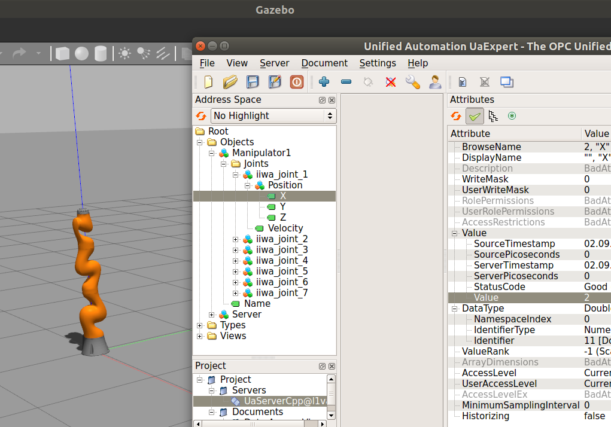

# gazebo_opcua
Gazebo OPC UA integration

Currently supports creating manipulator/positon/velocity objects 
and simple set/read of values over OPC UA. Server is notified 
when updating one of the values. WIP: PubSub integration.

## Build
1. Download C++ based OPC UA Client/Server SDK from here (https://www.unified-automation.com/downloads/opc-ua-development/c-opc-ua-client-server.html)
2. Extract and set `export UASDK_BASE_DIR=PATH_TO_DOWNLOADED_SDK/sdk/`
3. Clean build directory except ServerConfig.xml file (or copy it later from sdk)
4. cd build && cmake .. -DCMAKE_BUILD_TYPE=Debug && make

## Run
1. Go to the root of the project `cd gazebo_opcua` or `cd ..` after building
2. To find the plugin: 
`export GAZEBO_PLUGIN_PATH=${GAZEBO_PLUGIN_PATH}:./build`
3. To find model files:
`export GAZEBO_MODEL_PATH=${GAZEBO_MODEL_PATH}:./models` 
4. `gazebo iiwa14.world`

Or better (paused and verbose): `gazebo -u iiwa14.world --verbose`
